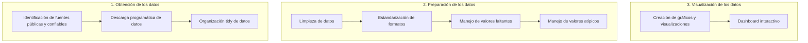

# Proyecto Red de Banco de Alimentos de México
Este proyecto es parte del curso "Ingeniería de Características" de la Maestría en Ciencia de Datos de la Universidad de Sonora. Su motivación principal es contribuir a la Red de Bancos de Alimentos de México (red BAMX) mediante el análisis de datos públicos relacionados con la producción y el mercado de alimentos a nivel nacional. El objetivo final es realizar el "Storytelling" que permita a la red BAMX identificar ventanas de oportunidad para optimizar sus procedimientos en la colecta y redistribución de alimentos.

  

  <em>Figura 1: Logo de la red del Banco de Alimentos de México.</em>

## Integrantes del equipo

- José Carlos Barreras Maldonado
- Luis Ernesto Ortíz Villalón
- Vesna Camile Pivac Alcaraz

## Descripción del proyecto

El proyecto se divide en tres partes fundamentales:

**1. Obtención de los datos**

El objetivo de esta fase es la identificación y descarga de los datos necesarios de fuentes públicas y confiables. Esto se lleva a cabo de manera programática, para que cualquier persona pueda replicar la descarga simplificadamente por medio de líneas de código. El resultado final son los datos sin ningún tipo de procesamiento, pero organizados de manera *tidy*. Esto se refiere a que los datos cumplen con las condiciones de que cada columna sea una variable y cada fila una observación.

**2. Preparación de los datos**

Esta etapa se enfoca en la transformación y acondicionamiento de los datos adquiridos para su posterior análisis. Los datos obtenidos en la etapa anterior pueden presentar inconsistencias, formatos no adecuados, valores faltantes o valores atípicos. Para garantizar la fiabilidad y la utilidad de estos, se realizan las siguientes acciones:

* *Limpieza de datos:* Se identifican y corrigen inconsistencias en los valores, eliminando datos duplicados o erróneos.
  
* *Estandarización de formatos:* Se asegura que los datos sigan un formato coherente y que los tipos de datos sean apropiados para su análisis.
  
* *Manejo de valores faltantes:* Se abordan los valores faltantes de manera adecuada, ya sea rellenándolos con estimadores o eliminando registros incompletos, dependiendo del impacto en el análisis.

* *Manejo de valores atípicos:* Se aplican técnicas estadísticas para identificar y se decidir cómo tratarlos, ya sea corrigiéndolos, transformándolos o manteniéndolos según su relevancia para la historia que se narra con los datos.
  
**3. Visualización de los datos**

En esta parte del proyecto se da vida a los datos a través de gráficos y representaciones visuales. La información recopilada se presenta de manera efectiva en un *dashboard* interactivo que facilita la identificación de patrones, tendencias y áreas de interés. Estas visualizaciones ayudan a contar la historia que se encuentra en los datos, proporcionando una visión clara y accesible para la red BAMX.

Las visualizaciones se diseñan metodológicamente para destacar aspectos relevantes de la producción y el mercado de alimentos a nivel nacional. Este proceso permite identificar oportunidades significativas que podrían beneficiar a la red BAMX en la optimización de sus procedimientos de recolección y redistribución de alimentos.

  <em>Figura 2: Descripción de las 3 etapas que conforman el proyecto.</em>

## 1. Obtención de los datos

### SIAP

  

  <em>Figura 3: Fuente de información de producción agroalimentaria SIAP.</em>

La principal fuente para la obtención de datos relacionados con la producción de alimentos en el campo es el Servicio de Información Agroalimentaria y Pesquera (SIAP). A esta plataforma se puede acceder por medio del siguiente [enlace](https://www.gob.mx/siap). Dentro de los datos de relevancia proporcionados por esta fuente se encuentran las hectareas de cultivo sembrada, cosechada y siniestrada, junto con su respectiva producción y rendimiento. Desde la perspectiva geográfica, la plataforma ofrece al usuario la posibilidad de solicitar estos datos para todos los municipios de cada estado. Por otro lado, la resolución temporal mínima permitida se basa en reportes con los avances mensuales de cada año. 

  
  

  <em>Figura 4: Ejemplo de filtros y datos obtenidos directamente en la plataforma SIAP.</em>

Para la adquisición programática de los datos, es necesario realizar un *request* al *endpoint* ["https://nube.siap.gob.mx/avance_agricola/"](https://nube.siap.gob.mx/avance_agricola/). Como resultado, se obtiene una cadena de texto en formato XML que contiene una tabla equivalente a la mostrada en la figura, pero cuyo contenido depende de los identificadores (ID's) proporcionados en el *request*. Es importante mencionar que estos ID no están disponibles directamente en la plataforma, por lo que fue necesario manipular los filtros para su obtención. Una vez adquiridos, los ID's fueron almacenados en un JSON, el cual fue añadido al presente repositorio (Victor-dict.json). Para la obtención de los datos de las cadenas de texto con formato XML es necesario aplicar un *parsing* utilizando BeautifulSoup, de modo que se facilite la identificación y extracción del contenido de cada una de las celdas. 

Dado que el interés principal es obtener datos mensuales de cada cultivo desde 2018 hasta el presente año, el siguiente paso consistió en repetir este proceso anidadamente para los ID de años, meses y cultivos de interés. En cada iteración, el contenido de la tabla correspondiente a un mes de un año en particular se almacenó en un archivo CSV en la carpeta "raw" del presente repositorio, siguiendo el formato: "Avance_Agricola_año_mes.csv". A estos datos se la añade una columna "Cultivo", cuyo valor indica el cultivo al que se refieren los datos. En total, al tratarse de 6 años y 12 meses, se obtuvo un apróximado de 72 archivos (en realidad son menos porque el 2023 está incompleto). Posteriormente, estos archivos locales se volvieron a cargar en el entorno de programación para organizarlos de manera *tidy*. Esto implicó combinarlos en un único dataframe al que se le agregaron columnas para "año" y "mes". Este dataframe se almacena también en un archivo CSV, el cual fue añadido al repositorio. 

Como nota, es necesario mencionar que no se iteró sobre las categorías de los filtros de Riego y Modalidad. En su lugar, en ambos casos se empleó la categoría que abarca a todas las otras.  

## Dataframe tidy

A continuación se muestra una descripción del DataFrame que estamos utilizando en este proyecto el cual se guardo en formato parquet.

### Información general

- **Nombre del DataFrame:** tidy.parquet
- **Número de filas:** 992213
- **Número de columnas:** 10

### Columnas

A continuación, se muestra una lista de las columnas en el DataFrame tidy, junto con una breve descripción de cada una:

| **Columna** | **Descripción** |
|---------|-------------|
| Entidad              | Entidad a la que pertenece el dato |
| Municipio            | Nombre del municipio al que pertenece el dato        |
| Superficie Sembrada  | Superficie destinada a la siembra                     |
| Superficie Cosechada | Superficie cosechada                                  |
| Superficie Siniestrada| Superficie siniestrada                                |
| Produccion           | Cantidad de producción                                |
| Rendimiento          | Rendimiento del cultivo                               |
| Anio                 | Año en el que se registraron los datos                |
| Mes                  | Mes en el que se registraron los datos                |
| Cultivo              | Tipo de cultivo   

Aquí hay una muestra de las primeras filas del DataFrame para que puedas tener una idea de cómo se ven los datos:

| **Entidad**             | **Municipio**          | **Superficie Sembrada** | **Superficie Cosechada** | **Superficie Siniestrada** | **Produccion** | **Rendimiento** | **Anio** | **Mes**   | **Cultivo** |
|---------------------|--------------------|:----------------------:|:-----------------------:|:-------------------------:|:------------:|:-------------:|------|-------|---------|
| Aguascalientes      | Aguascalientes     | 8.00                 | 0.00                  | 0.0                     | 0.00       | 0           | 2023 | Enero | Agave   |
| Baja California Sur | La Paz             | 3.00                 | 0.00                  | 0.0                     | 0.00       | 0           | 2023 | Enero | Agave   |
| Colima              | Manzanillo         | 86.29                | 0.00                  | 0.0                     | 0.00       | 0           | 2023 | Enero | Agave   |
| Durango             | Durango            | 13.00                | 0.00                  | 0.0                     | 0.00       | 0           | 2023 | Enero | Agave   |
| Durango             | Mezquital          | 110.00               | 0.00                  | 0.0                     | 0.00       | 0           | 2023 | Enero | Agave   |

